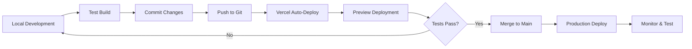

# 🚀 Vercel Deployment Guide - Party OS

## Pre-Deployment Checklist ✅

### Code Quality
- [x] Production build passes (`npm run build`)
- [x] TypeScript errors fixed (winner → leader, animation property)
- [x] All dependencies installed
- [x] PWA files created (manifest.json, sw.js, icons)

### Configuration Files
- [x] `vercel.json` created with proper headers and settings
- [x] `.env.example` available for reference
- [x] `.env.local` updated with SA1 Pusher cluster
- [x] `next.config.js` configured for production

## Step 1: Install Vercel CLI

```bash
npm install -g vercel
```

## Step 2: Login to Vercel

```bash
vercel login
```

## Step 3: Link Your Project (First Time Only)

```bash
vercel link
```

Follow the prompts:
- Set up and deploy? **Yes**
- Which scope? Choose your account
- Link to existing project? **No** (first time)
- Project name? **familyverse-party-os** (or your choice)
- Directory? **./** (current directory)

## Step 4: Set Environment Variables

### Via Vercel Dashboard (Recommended)
1. Go to https://vercel.com/dashboard
2. Select your project
3. Go to **Settings → Environment Variables**
4. Add these variables:

#### Required Variables

**Database:**
```
DATABASE_URL=your_neon_postgres_connection_string
```

**Firebase (8 variables):**
```
NEXT_PUBLIC_FIREBASE_API_KEY=your_api_key
NEXT_PUBLIC_FIREBASE_AUTH_DOMAIN=your_auth_domain
NEXT_PUBLIC_FIREBASE_PROJECT_ID=your_project_id
NEXT_PUBLIC_FIREBASE_STORAGE_BUCKET=your_storage_bucket
NEXT_PUBLIC_FIREBASE_MESSAGING_SENDER_ID=your_sender_id
NEXT_PUBLIC_FIREBASE_APP_ID=your_app_id
FIREBASE_CLIENT_EMAIL=your_service_account_email
FIREBASE_PRIVATE_KEY=your_private_key
```

**Pusher (South Africa Cluster):**
```
PUSHER_APP_ID=your_app_id
PUSHER_KEY=your_key
PUSHER_SECRET=your_secret
PUSHER_CLUSTER=sa1
NEXT_PUBLIC_PUSHER_KEY=your_key
NEXT_PUBLIC_PUSHER_CLUSTER=sa1
```

#### Optional Variables
```
GOOGLE_GENERATIVE_AI_API_KEY=your_google_ai_key
GOOGLE_GENAI_API_KEY=your_google_ai_key
NEXT_PUBLIC_APP_URL=https://your-app.vercel.app
```

### Via Vercel CLI (Alternative)
```bash
# Set one variable at a time
vercel env add DATABASE_URL production
vercel env add NEXT_PUBLIC_PUSHER_KEY production
# ... continue for all variables
```

## Step 5: Deploy to Production

### Quick Deploy
```bash
vercel --prod
```

### Deploy with Build Logs
```bash
vercel --prod --debug
```

## Step 6: Verify Deployment

After deployment, test these URLs:

1. **Homepage**: `https://your-app.vercel.app`
2. **PWA Manifest**: `https://your-app.vercel.app/manifest.json`
3. **Service Worker**: `https://your-app.vercel.app/sw.js`
4. **Party Join**: `https://your-app.vercel.app/party/join`
5. **Sticker Factory**: `https://your-app.vercel.app/admin/stickers`

## Step 7: Test PWA Installation

### On Mobile (Android/Chrome)
1. Visit your Vercel URL
2. Wait 5 seconds for install prompt
3. Tap **"Install"**
4. Verify app appears on home screen
5. Launch and test features

### On Mobile (iOS/Safari)
1. Visit your Vercel URL in Safari
2. Tap Share button
3. Tap **"Add to Home Screen"**
4. Launch and test features

### On Desktop (Chrome)
1. Visit your Vercel URL
2. Click install icon in address bar (or wait for prompt)
3. Click **"Install"**
4. App opens in standalone window

## Troubleshooting

### Build Fails

**Error: Module not found**
```bash
# Fix: Install missing dependencies locally and push
npm install
git add package.json package-lock.json
git commit -m "fix: add missing dependencies"
git push
```

**Error: Environment variables missing**
- Check Vercel dashboard → Settings → Environment Variables
- Ensure all required variables are set
- Redeploy: `vercel --prod`

### PWA Not Installing

**Manifest not loading:**
- Check `https://your-app.vercel.app/manifest.json` directly
- Verify `vercel.json` headers are correct
- Clear browser cache and try again

**Service Worker not registering:**
- Check browser console for errors
- Verify `/sw.js` is accessible
- Ensure HTTPS is enabled (Vercel provides this automatically)

**Install prompt not showing:**
- Wait 5 seconds after page load
- Check if already installed (displayMode: standalone)
- Test in incognito mode
- Check dismissal timestamp in localStorage

### Real-time Features Not Working

**Pusher connection fails:**
- Verify Pusher environment variables in Vercel
- Check `NEXT_PUBLIC_PUSHER_CLUSTER=sa1` (South Africa)
- Test Pusher connection in browser console:
  ```javascript
  // Open browser console and check for Pusher logs
  ```

**Chat not loading:**
- Verify Firebase Auth is configured
- Check network tab for API errors
- Ensure database connection is working

### Performance Issues

**Slow initial load:**
- Check Vercel Analytics for insights
- Verify static pages are generating correctly
- Consider adding more routes to static generation

**Images not loading:**
- Verify Firebase Storage rules allow public access
- Check `remotePatterns` in next.config.js
- Test image URLs directly

## Continuous Deployment

### Automatic Deployments via Git

1. Connect your GitHub/GitLab repository in Vercel dashboard
2. Push to main branch: `git push origin main`
3. Vercel automatically builds and deploys
4. Preview deployments for pull requests

### Manual Deployments

```bash
# Preview deployment (test before production)
vercel

# Production deployment
vercel --prod

# Rollback to previous deployment
vercel rollback
```

## Monitoring Post-Deployment

### Vercel Analytics
- Real-time visitor stats
- Core Web Vitals
- Page performance metrics

### Check Logs
```bash
# View production logs
vercel logs --prod

# Follow logs in real-time
vercel logs --prod --follow
```

### Firebase Console
- Monitor authentication
- Check database usage
- Review storage metrics

### Pusher Dashboard
- Monitor concurrent connections
- Check message volume
- Review channel activity

## Scaling Considerations

### Vercel Plan Limits
- **Hobby**: 100GB bandwidth, unlimited sites
- **Pro**: 1TB bandwidth, team collaboration
- **Enterprise**: Custom limits, SLA

### Database Scaling (Neon)
- Monitor concurrent connections
- Upgrade plan if needed
- Consider connection pooling

### Pusher Scaling
- **Free**: 100 concurrent connections, 200,000 messages/day
- **Paid**: Higher limits as needed

## Custom Domain Setup

1. Go to Vercel dashboard → Your Project → Settings → Domains
2. Add your domain: `partyos.yourdomain.com`
3. Configure DNS records (Vercel provides instructions)
4. Wait for SSL certificate generation (automatic)
5. Update `NEXT_PUBLIC_APP_URL` environment variable

## Security Best Practices

- [x] Environment variables not in git
- [x] Firebase security rules configured
- [x] Database uses prepared statements
- [ ] Enable Vercel Password Protection (optional, for staging)
- [ ] Set up Vercel's Web Application Firewall (Pro plan)

## Performance Optimization

### Vercel Edge Network
- Automatic CDN distribution
- Global edge caching
- DDoS protection

### Next.js Optimization
- [x] Static page generation where possible
- [x] Image optimization with next/image
- [x] Code splitting automatically handled
- [ ] Consider adding ISR (Incremental Static Regeneration) for dynamic routes

### PWA Optimization
- [x] Service worker caching strategy
- [x] Offline fallback pages
- [ ] Consider precaching critical assets
- [ ] Add background sync for offline actions

## Deployment Workflow



## Quick Reference Commands

```bash
# Install Vercel CLI
npm install -g vercel

# Login
vercel login

# Link project (first time)
vercel link

# Preview deployment
vercel

# Production deployment
vercel --prod

# View logs
vercel logs --prod

# List deployments
vercel ls

# Rollback
vercel rollback

# Check build status
vercel inspect [deployment-url]
```

## Success Checklist

After deployment, verify:

- [ ] Homepage loads without errors
- [ ] Users can join parties
- [ ] PWA install prompt appears
- [ ] Service worker registers
- [ ] Real-time features work (Pusher)
- [ ] Chat loads and updates
- [ ] Leaderboards update live
- [ ] Sticker Factory generates QRs
- [ ] Mobile UI is responsive
- [ ] Audio unlocks on welcome screen
- [ ] All icons load correctly
- [ ] SSL certificate is active
- [ ] No console errors
- [ ] Lighthouse PWA score > 90
- [ ] Performance metrics acceptable

## Next Steps After Deployment

1. **Share the URL** with party guests
2. **Test all features** end-to-end
3. **Monitor logs** for any errors
4. **Gather user feedback** on mobile experience
5. **Consider APK generation** using PWABuilder
6. **Set up analytics** to track usage

## Support Resources

- **Vercel Docs**: https://vercel.com/docs
- **Next.js Docs**: https://nextjs.org/docs
- **Pusher Docs**: https://pusher.com/docs
- **PWA Best Practices**: https://web.dev/progressive-web-apps/

## Emergency Contacts

- Vercel Support: support@vercel.com (Pro+ plan)
- Community: https://vercel.com/community

---

**Ready to deploy?**

```bash
vercel --prod
```

🎉 **Your party app is going live!**
